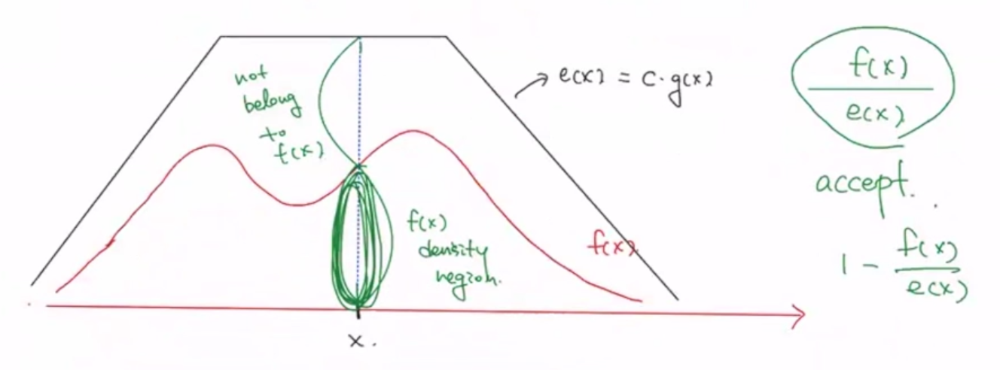
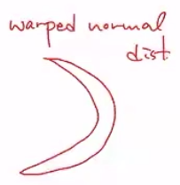

# Review

----

## Wk01

1. Write the inverse-CDF method and state how we can generate random numbers from $$W(\alpha, \beta)$$.

inverse-CDF method는, 우리가 알다싶이 $$0 \le F(x) \le 1$$. 즉 $$F(x) \sim U(0,1)$$나 다름없다.  $$u \sim U(0,1)$$을 하나 샘플링. 이는 $$F(x)$$의 range와 일치한다. 따라서 $$F(x)=u \iff x=F^{-1} (u)$$.

* Weibull Dist:   shape parameter $$k$$, scale parameter $$\lambda$$에 대해

$$
f(x) =  \begin{cases} \left( \dfrac {k}{\lambda} \right) \left( \dfrac {x}{\lambda} \right)^{k-1} \exp{- \left( \dfrac{x}{\lambda} \right) } & x\ge 0 \\ \\ 0 & o.w. \end{cases}
$$

 
let quantity $$X$$ is "time-to-failure".

$$
\begin{align}
F(x) = 1- \exp{- \left( \dfrac{x}{\lambda} \right) } &= u \\
\Longrightarrow x &= \lambda \left[ -\log (1-u) \right]^{\tfrac{1}{k}}

\end{align}
$$

2. State the RS algorithm.

| | target density   $$f(x)$$ | proposal density   $$g(x)$$ | envelope density   $$e(x) = c \ast g(x)$$ | 
| :-: | :-: | :-: | :-: |
| evaluate | easy | easy | |
| generate | difficult | easy | |
| | | | cover all areas of $$f(x)$$,   in all parameter supports, $$f(x) \le e(x)$$|

3. State how we can generate random numbers using RS.
	1. generate sample $$x$$ from $$g(x)$$
	2. generate $$u \sim U(0,1)$$
	3. 위에서 언급하였듯, envelope는 proposal의 상수배이며, envelope는 target보다 항상 크므로 $$\dfrac{f(x)}{e(x)}$$는 항상 0 이상이며 1 이하. 이는 곧 $$U(0,1)$$에서 생산되는 값과 동일한 분포를 지니며, $$e(x)$$ 아래의 값들 중 $$f(x)$$ 아래에도 해당하는 값들은 곧 $$f(x)$$에서 생산된 난수라고 볼 수 있었다. 따라서 if $$u \le \dfrac{f(x)}{e(x)}$$, sample $$x$$를 accept, 이외엔 reject.

----

## wk03

1. State one iteration of squeezing RS.

$$f(x)$$가 evaluate 자체는 가능한데 그거조차도 비용이 expensive 한 경우를 가정. $$f(x)$$가 샘플 generate가 어려우니 RS를 쓰는건데 평가 비용조차 높으니 샘플링 과정이 비효율적일 수밖에 없음. 따라서 squeeze function $$s(x)$$를 설정하여 확실하게 $$f(x)$$에 속하는 샘플들은 먼저 우선선발 시켜서 패스시키고, 우선선발이 아닌 샘플들만 $$f(x)$$를 직접 사용해서 조건을 통과하였는지 여부를 체크. 당연하지만 $$s(x)$$는 모든 support에서 $$f(x)$$보다 작아야 하며, evaluate 비용이 cheap해야 함.

proceeds:
1. $$Y \sim g$$에서 샘플링.
2. sample $$u \sim U(0,1)$$.
3. if $$U \le \dfrac {s(Y)}{e(Y) = c \ast g(y)}$$, keep $$Y$$. 
4. if not, whether if $$U \le \dfrac {f(Y)}{e(Y)}$$, keep $$Y$$. 
5. both are not, reject $$Y$$.

이때 $$s(x)$$를 생산하기 위해 Talyor Series Expansion을 사용하는 경우 잦다.

2. State the adaptive RS.

Make envelope function $$e(x)$$ adaptively to the shape of $$f(x)$$.

adaptive RS 자체에는 제약이 있다. 이는 log concave function인 density에만 적용이 가능하다는 것. 즉슨 multimodal인 density에는 적용이 불가하다. 이 제약을 해소하기 위해 Adaptive Rejection Metropolis Sampling이 존재.

**mode가 필수라는 게 RS 자체가 mode가 필수라는 소리인가?**

3. State the Importance Sampling

$$\mu = E[h(x)]$$. 이때 $$h(x)$$는 $$x$$의 함수이며, $$x$$는 $$f(x)$$를 따르므로 $$h(x)$$의 기댓값 계산 또한 이를 따르지만, 이는 기댓값 계산에서 density를 $$g$$로 바꾸고 이의 각 확률에 발생하는 값들을 $$h \ast \dfrac{f}{g}$$로 바꾸는 것과 다르지 않음. 이는 $$f$$에서 샘플 생산이 힘들때 $$f$$를 거치지 않고도 샘플을 생산하여 기댓값을 계산할 수 있다는 점에서 빛을 발함. 즉 확률은 $$g$$를 참조하고, 이 확률에서 발생하는 값들이 있을 것이고, 이 값들을 다시 한번 함수에 넣어서 역변환하면 $$f$$의 확률에서 발생했었을 각 값들을 획득하는 것이 가능하다는 소리.

이러한 역변환 함수에서 $$f, g$$가 차지하는 부분을 weight라고 부르는 것이고, 이를 weight의 총합으로 표준화하면 standardized weight.

$$g$$의 support가 $$f$$의 그것을 다 덮을 필요는 없음. 하지만 1. $$\dfrac{f}{g}$$는 bounded여야 하고, 가장 중요하게, $$g$$는 $$f$$보다 꼬리가 두꺼워야 함. 이는 극단적인 $$x$$값이 나왔을 때 $$g$$의 확률이 $$f$$보다 지나치게 작으면 해당 부분에서의 weight가 너무너무 커져서 다른 샘플 실값들의 영향력을 다 잡아먹어버리는 **weight-degeneracy**가 발생해버리기 때문.

4. State the polar methods for generating normal random variable.

$$ X, Y \overset {iid} {\sim} N(0,1)$$

f(x,y) = \dfrac{1} {2\pi} \exp\left( -\dfrac{1}{2} (x^2 + y^2 )\right)

$$\theta \sim U(0, 2\pi)$$, $$R^2 \sim \EXP (\tfrac{1}{2})$$.

$$X$$와 $$Y$$를 모은 만큼의 샘플이 $$N$$을 따른다.

## wk04, 05 
 
1. State the effect of proposaldensity $$g$$ in IS.

과도한 variability를 피하기 위해, $$\dfrac{f}{g}$$로 설정하고 $$g$$가 $$f$$보다 두꺼운 꼬리를 지니도록 설정해야 함. $$g$$가 너무 작으면 weight-degeneracy.

$$h$$가 너무 작다면, $$\dfrac{f}{g}$$를 크게 할 수 있는 $$g$$를 선정한다.

2. State the antithetic sampling, Control Variate, and Rao-Balckwellization.

antithetic: use two id UE, whose $$Corr(\hat \mu_1 , \hat \mu_2)<0$$.

3. State one iteration of sampling Importance Resampling.
 

5. 왜 옛날에는 variance reduction 하고 요즘엔 안함?
----

