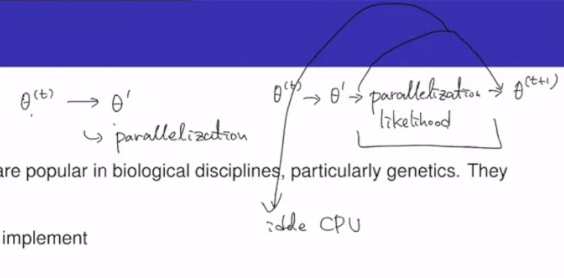

# Approximate Bayesian Computation

Likelihood를 사용하지 않고 Summary Stat을 사용함. 이와 같은 성질로 인해 Likelihood-free inference라고도 불리며, 이의 근거는 simulator-based model (모델 자체를 data generation process라고 보는 것. 모델을 통해 data를 생산해내는 것이 가능하다는 소리). 모델이 있으면, 이 모델과 대응하는 패러미터가 존재할 것. 이 모델 자체를 하나의 data generating process라고 본다면, 당연히 우리는 Auxiliary Data를 생산하는 것 또한 가능. 이 AD를 생산하는 것이 가능하기 때문에, 이렇게 생산한 AD 데이터가 기존 데이터 (original data) 와 얼마만큼 가까운지, 아니면 얼마만큼 떨어져 있는지를 체크하는 것이 ABC 방법론. 이것이 충분히 가깝다면 우리가 가지고 있는 패러미터를 패러미터의 샘플로 인정하는 것이 가능하다는 것. 이때 직접 AD와 OD를 비교하는 것인 대단히 어려우므로 대체재로 Summary Stat을 사용함. 이것이 ABC 방법론의 핵심. 이는 genetics에서 개발됨.

## Simulator-Based Models

**deterministic model**은 뭐임?

모든 모델이 pdf $$p(y \vert \theta)$$의 family로 특정되는 것은 아님.

- Simulator-based Models: Models which are specified via a mechanism (rule) for generating data.

Models specified via a data generating mechanism occur in multiple and diverse scientific fields.

- Different communities use different names for simulator-based models: 
	- Generative Models: 데이터를 생성해주는 메커니즘을 연구하는 모델
	- Implicit Models
	- Stochastic Simulation Models
	- Probabilistic Programs

- Examples
	- Astrophysics: Simulating the formation of galaxies, stars, or planets.
	- Evolutionary Biology: Simulating Evolution
	- Neuroscience: Simulating Neural Circuits
	- Ecology: Simulating Species Migration
	- Health Science: Simulating the spread of an infectious disease

- Advantages of Simulator-Based Models
	- Direct implementation of hypotheses of how the observed data were generated. obs가 어떻게 생산되었는지에 대한 가설을 입증할 수 있는 하나의 방법이 됨.
	- Neat interface with physical or biological models of data. 갖고 있는 데이터는 한둘에서 끝나고 이의 variation을 고려하는 것이 중요한데 이 variation을 연구하는건 데이터 한둘로는 어려움. 이때 가지고 있는 데이터를 replicate하고 simulator-based model을 이용해 비슷한 데이터를 만들어내서 variation을 연구해 좀더 정확한 inference를 가능케 하고, 그러면서 uncertainty quantification도 가능하게 함.  
	- Modeling by replicating the mechanisms of nature which produced the
	- observed/measured data. (“Analysis by synthesis”)
	- Possibility to perform experiments.

- Disadvantages of Simulator-Based Models
	- Generally elude analytical treatment. analytic한 solution이 없어 수학적 증명이 어려움. Approximate BC인 이유가 여기 있음
	- Can be easily made more complicated than necessary.
	- Statistical inference is difficult but possible.

- Family of pdfs Induced by the Simulator: 

For any fixed $$\theta$$ (패러미터 $$\theta$$ 는 주어져 있다는 소리), the output of the simulator $$y_\theta = g( \cdot \; , \theta)$$ is a **random variable**. 즉 $$\theta \longrightarrow y_\theta$$. No closed-form available for $$p(y \vert \theta)$$, and Simulator defines the model pdfs $$p(y \vert \theta)$$ implicitly.

----
 
 
 

## Approximate Bayesian Computation (ABC)

### Intractability

$$
\pi (\theta \vert D ) = \dfrac{\pi (D  \vert \theta) \pi (\theta) }{\pi (D)}
$$

- Usual intractability in Bayesian inference is not knowing $${\pi (D)}$$, which is marginal Likelihood of Data. 
- $$\pi (D  \vert \theta) = \kappa(\theta)\pi (D  \vert \theta)$$ 인 경우라면, MH 알고리즘을 사용하면 됨. 계산 과정에서 $$\pi (D  \vert \theta)$$가 캔슬되니까. 그러나 $$\pi (D  \vert \theta) = \kappa(\theta)f (D  \vert \theta)$$, $$f (D  \vert \theta)$$ 가 unnormalized density인 경우라면 이는 **doubly-intractable** 케이스. 캔슬도 안되고 고려해줄수밖에 없음. (with $$\kappa(\theta)$$ unknown.)
	- ABC가 해법이 된다. 만능은 아님. 적용에 약간 회의적.
- A problem is **completely-intractable** if $$\pi (D  \vert \theta)$$ is unknown and cannot be evaluated (unknown is subjective). That is, if the analytic distribution of the simulator, $$f(\theta)$$ run at $$\theta$$ is unknown. 모델이 지나치게 복잡해서 명시적으로 Likelihood 자체가 주어지지 않는 경우가 존재함.

Completely intractable models are where we need to resort to ABC methods. (Likelihood가 intractable한 모델에서 ABC가 많이 사용된다. 전 챕터에서 언급된 Doubly Intractable 모델이 대표적인 예. 단 ABC가 스켈레톤 키는 아님. ABC도 패러미터 튜닝이 요구되고, 이 패러미터 튜닝은 상당히 어려움. 따라서 ABC도 상당히 약점이 많음.)

- Genetic Background of ABC
	- ABC is a recent computational technique that only requires being able to sample from the likelihood $$f(\cdot \; \theta)$$
	- This technique stemmed from population genetics models, about 15 years ago, and population geneticists still contribute significantly to methodological developments of ABC.
	- Population Genetics
		- Describe the genotypes (AA, AO, etc ⇔ penotypes A) , estimate the alleles frequencies, determine their distribution among individuals, populations and between populations.
		- Predict and understand the evolution of gene frequencies in populations as a result of various factors.
	- Analyses the effect of various evolutive forces (mutation, drift, migration, selection) on the evolution of gene frequencies in time and space.

If the likelihood function is intractable, then ABC (approximate Bayesian computation) is one of the few approaches we can use to do inference.

 

ABC algorithms are a collection of Monte Carlo methods used for calibrating simulators. ABC 자체는 simulator-based model을 calibration한 모델이기 때문에 우리가 Likelihood function에 대해 명시적으로 알 필요가 없다.
- they do not require explicit knowledge of the likelihood function.
- inference is done using simulation from the model (they are ‘likelihood-free’).

ABC methods are popular in biological disciplines, particularly genetics. They are
- Simple to implement
- Intuitive
- Embrassingly parallelizable (MCMC 모델이 아니기 때문에 생기는 성질. multiple chain으로 돌려도 괜찮다는 이야기이다.) MCMC의 사용 상황은 아래의 그림과 같이 도식화된다.
- Can usually be applied

- Proceeds:

Target is $$\pi(\theta)f(x \vert \theta)$$. When likelihood $$f(x \vert \theta)$$ not in closed form, likelihood-free rejection technique of ABC Algorithm is:

$$y \sim f(y \vert \theta)$$, under the prior $$\pi(\theta)$$ (population genetics에서는 prior information이 대단히 강력하다. 따라서 prior에서 샘플을 생산해도 무관하며, ABC의 이러한 성질은 이의 연장선이다.), keep jointly simulating

$$
\pi ' \sim \text{prior } \pi(\theta) \\
\\
\text{auxiliary variable } z \sim f(z \vert \theta ' )
$$

until the $$z$$ is equal to the observed value $$y$$. $$z = y$$라는 결과를 얻을 때까지 위의 과정을 반복. $$z = y$$가 된다면 $$\theta ' $$를 accept.

- Proof

$$
\begin{alignat}{4}
f(\theta_i) &\propto \sum_{z \in \mathcal{D}} \pi(\theta_i) f(z \vert \theta_i) l_y(z) && \\

&\propto \pi(\theta_i) f(y \vert \theta_i) &&= \pi (\theta_i \vert y)

\end{alignat}
$$

- Tolerance Condition

When $$y$$ is a continuous rv, $$z = y$$ is replaced with a tolerance condition, $$\rho(y,z) \le \epsilon$$, where $$\rho$$ is a **distance**.

Output distributed from

$$

\pi(\theta) \ast P_\theta \left\{ \rho(y,z) > \epsilon \right\} \; \; \propto \; \; \pi \left( \theta \Big \vert \rho(y,z) > \epsilon \right)

$$

하지만 이 방법은
- $$\epsilon$$ 결정이 어려움
- distance $$d(z,y)$$ 계산이 어려움

The idea behind ABC is that the **summary statistics** coupled with a small tolerance should provide a good approximation of the posterior: 위의 난점을 해결하기 위해 **summary statistics** $$\eta(z), \eta(y)$$를 사용하여 $$dist\left\{ \eta(z), \eta(y) \right\}$$를 구하여 이를 기준점으로 사용.

$$
\begin{align}
\pi_\epsilon (\theta \vert y) &= \int \pi_\epsilon (\theta , z \vert y)dz  \\ &\approx \pi \left( \theta \vert \eta(y) \right)
\end{align}
$$

where $$\eta(y)$$ defines a (**not necessarily sufficient**) statistic. 하지만 대부분의 경우에는 SS를 이용은 함. 

- Proceeds:

For each iteration,
1. Repeat followings until $$\rho \left( \eta(z), \eta(y) \right) \le \epsilon$$.
	- Generate $$\theta '$$ from the prior distribution $$\pi(\cdot)$$.
	- Generate $$z$$ from the likelihood $$f(\cdot \; \vert \theta ' )$$.
2 Set $$\theta_i = \theta ' $$.

However, Simulating from the prior is often poor in efficiency. (population genetics에서는 strong prior를 사용했기 때문에 이러한 문제가 표면화되지 않았었음. 그러나 통계적 상황에서는 Bayesian prior를 사용하는 경우도 많으므로 이러한 문제가 유의해짐. 특히 **non-informative prior**를 쓸 때 poor performance 가능성 높아짐)
- By modifying the proposal distribution on $$\theta$$ to increase the density of $$x$$’s within the vicinity of $$y$$. $$\theta$$의 proposal 제안할 때 그 과정을 개선한다는 소리. 
- By viewing the problem as a conditional density estimation and by developing techniques to allow for larger $$\epsilon$$. $$\epsilon$$ 잡기가 너무 어려워서 ABC 자체가 애매해짐. summary statistics 따라 $$\epsilon$$이 항상 바뀌고 이거에 대한 규칙성도 현재로서는 없음. Summary Statistics가 모든 정보를 담고 있지 않아서, summary statistics로 **model selection**을 하려는 시도는 있었지만 실패했음. summary statistics가 담고 있는 정보가 데이터의 성질을 온전히 드러내고 있는지조차도 불명확함. 
- By including $$\epsilon$$ in the inferential framework.

$$\epsilon$$ reflects the tension between computability and accuracy.
- As $$\epsilon \rightarrow \infty$$, we get observations from the prior, $$\pi(\theta)$$.
- If $$\epsilon=0$$, we generate observations from $$\pi(\theta \vert D)$$. posterior에서 뽑는 것이라고 생각할 수 있다. $$\epsilon=0$$에 가까우면 (최소한 summary statistics로는) $$y=z$$ 조건을 만족하는 것.

ABC가 사용 불가한 상황은?
- if the data are too high dimensional, we never observe simulations that are ‘close’ to the field data.
	- 데이터가 고차원이라면, 데이터의 차원들간의 interaction이 반드시 존재할 수밖에 없으므로, 기존 데이터와 같은 데이터를 생산해내는 것은 사실상 불가능
		-Reduce the dimension using summary statistics.
- 1개의 실현값 $$\theta'$$ 에서 summary statistics를 10000개 $$\eta(z^{(1)}), \cdots, \eta(z^{(10000)})$$ 를 가령 생산한 상황이라면, 이 summary statistics의 distribution이 multimodal이면 절대로 사용불가.

----

### Potential Risks and Remedies in ABC

Non-zero tolerance $$\epsilon$$
- The inexactness introduces a bias in the computed posterior distribution.
- Practical studies of the sensitivity of the posterior distribution to the tolerance.
	- sensitivity analysis, specification difficult
- summary statistics를 쓰지 sufficient statistics를 쓰는게 아니기 때문에 필연적으로 information loss가 있고 CI가 넓어짐

Non-sufficient summary statistics
- The information loss causes inflated credible intervals.
- Automatic selection/semi-automatic identification of sufficient statistics. Model validation check.

Small number of models/Mis-specified models
- The investigated models are not representative/lack predictive power.
- Careful selection of models. Evaluation of the predictive power.

Priors and parameter ranges
- Conclusions may be sensitive to the choice of priors. Model choice may be meaningless.
- Check sensitivity of Bayes factors to the choice of priors. Use alternative methods for model validation.

Curse-of-dimensionality
- Low parameter acceptance rates. Model errors cannot be distinguished from an insufficient exploration of the parameter space. Risk of overfitting.
- Methods for model reduction if applicable. Methods to speed up the parameter exploration. Quality controls to detect overfitting.

Model ranking with summary statistics
- The computation of Bayes factors on summary statistics may not be related to the Bayes factors on the original data, which may therefore render the results meaningless.
- Only use summary statistics that fulfill the necessary and sufficient conditions to produce a consistent Bayesian model choice. Use alternative methods for model validation.

Implementation
- Low protection to common assumptions in the simulation and the inference process.
- Sanity checks of results.

----

 
 
 

## ABCifying Monte Carlo Methods

Rejection ABC is the basic ABC algorithm: rejection 알고리즘임
- Inefficient as it repeatedly samples from prior   More efficient sampling algorithms allow us to make better use of the available computational resource: spend more time in regions of parameter space likely to lead to accepted values.
- allows us to use smaller values of $$\epsilon$$, and hence finding better approximations.   Most Monte Carlo algorithms now have ABC versions for when we don’t know the likelihood

이를 개선하기 위해 제안되는 모델이 아래의 ABC-MCMC 알고리즘

----

 
 
 

## ABC-MCMC Algorithm

이 알고리즘에서는 Embrassingly parallelizable 성질을 잃어버리게 된다.

We are targeting the joint distribution

$$
\pi_{ABC} (\theta , x \vert D) \propto \pi_{\epsilon} (D \vert x) \pi (x \vert \theta) \pi(\theta)
$$

To explore the $$(\theta, x)$$ space, proposals of the form

$$
Q \left( (\theta, x), (\theta', x') \right) = q(\theta, \theta') \pi (x' \vert \theta ' )
$$

seem to be inevitable.

The MH acceptance probability is then

$$
\begin{align}
r &= \dfrac{\pi_{ABC} (\theta' , x' \vert D) Q \left( (\theta', x'), (\theta, x) \right)}{\pi_{ABC} (\theta , x \vert D) Q \left( (\theta, x), (\theta', x') \right)} \\

&= \dfrac{\pi_{\epsilon} (D \vert x') \pi (x' \vert \theta') \pi(\theta')}{\pi_{\epsilon} (D \vert x) \pi (x \vert \theta) \pi(\theta)} \dfrac{q(\theta', \theta) \pi (x' \vert \theta )}{q(\theta, \theta') \pi (x' \vert \theta ' )}

&= \dfrac{\pi_{\epsilon} (D \vert x')  \pi(\theta')}{\pi_{\epsilon} (D \vert x)  \pi(\theta)} \dfrac{q(\theta', \theta) }{q(\theta, \theta') }

\end{align}
$$

For each iteration,

1. Repeat followings until $$\rho \left( \eta(z), \eta(y) \right) \le \epsilon$$.
	- Propose $$\theta '$$ from a transition kernel $$g(\theta ' \vert \theta^{(t)})$$
	- Generate $$z$$ from the likelihood $$f(\cdot \vert \theta ')$$

2. accept or stay $$ = \begin{cases} \theta ' & \text{with probability MH ratio } \alpha = \min \left( 1, \; \; \dfrac{\pi(\theta ')}{\pi(\theta^{(t)})} \dfrac{g(\theta^{(t)} \vert \theta ')}{g(\theta ' \vert  \theta^{(t)} )} \right) \\ \theta & o.w. \end{cases}$$

즉 $$\theta '$$를 MH 알고리즘에서 생산하며, MH 알고리즘에서 생산하였으므로 $$z$$와 $$\theta '$$ 양쪽 모두가 수용할지 여부의 평가 대상. $$z$$가 수용되지 않았다면 $$\theta '$$도 수용되지 않고 $$\theta'$$를 새로 생산한다.

----

### ~~Sequential ABC Algorithms~~

The most popular efficient ABC algorithms are those based on sequential methods.

We aim to sample N particles successively from a sequence of distributions

$$
\pi_1 (\theta) , \cdots, \pi_T (\theta) = \text{target}
$$

For ABC, we decide upon a sequence of tolerance $$\epsilon_1 >\epsilon_2 > \cdots > \epsilon_T$$, and let $$\pi_t$$ be the ABC distribution found by the ABC algorithm when we use tolerance $$\epsilon_t$$.

----

### ~~Synthetic Likelihood~~

The synthetic likelihood approach of Wood (2010) is an ABC algorithm which uses a Gaussian likelihood. However, instead of using

$$
\begin{align}

\pi_\epsilon(D \vert X) &= N(D; X, \epsilon) \\
\pi_{ABC}(D \vert \theta)  &= \int N(D; X, \epsilon)\pi(X \vert \theta) dX

\end{align}
$$

they repeatedly run the simulator at $$\theta$$, generating $$X_1, \cdots, X_n$$, and then use

$$
\pi(D \vert \theta) = N \left( D ; \mu_\theta , \Sigma_\theta \right)
$$

where $$\mu_\theta$$ and $$\Sigma_\theta$$ is the sample mean and covariance of the (summary of the) simulator output.

