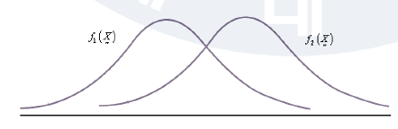
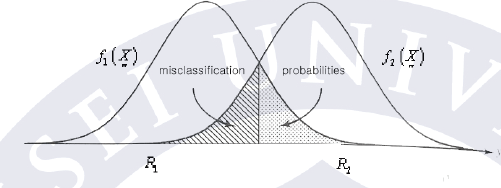
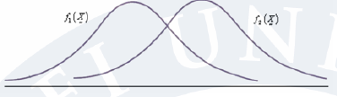
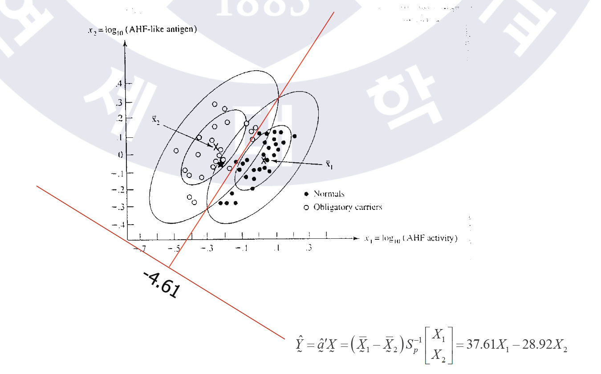
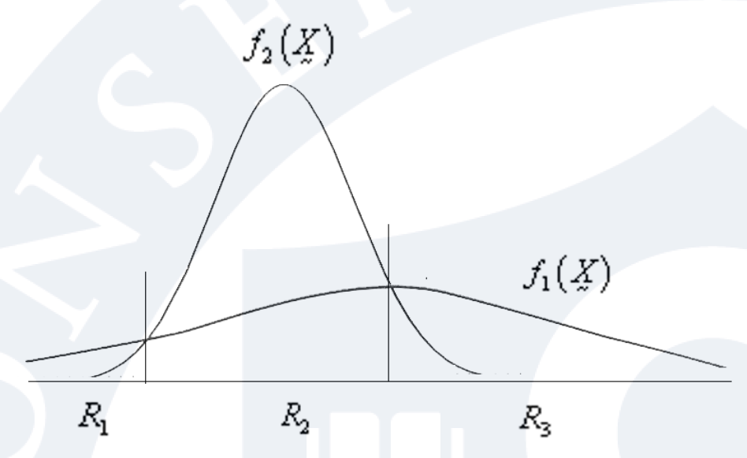
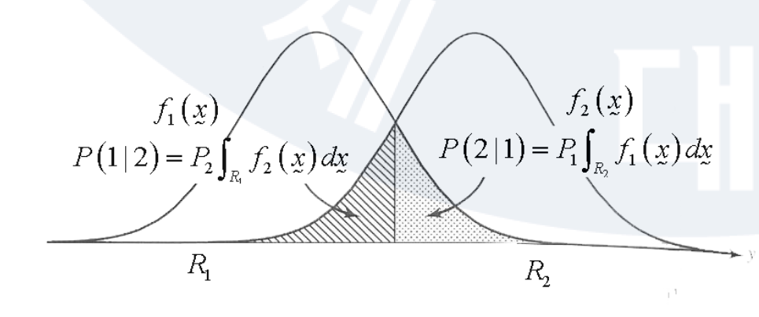

# Discrimination and Classification

1. 여러개의 다른 모집단으로부터 나온 데이터들을 **설명**. discriminants (구분자) 들의 발견. 
2. 관찰치를 **분류**하여 이를 클래스로 묶고 싶다. why인지는 크게 중요하지 않고, **예측**을 하고 싶다.

 
 

## Bayes Rule

let r$$v$$ for populations $$\pi_1 , \pi_2$$, $$\pmb X = (x_1 , \cdots, x_p)'$$. 이때, $$f_i(\pmb X)$$는 $$\pi_i$$의 pdf. $$R_i$$는 우리가 해당 object를 $$\pi_i$$로 분류하는 $$\pmb X$$ 값들의 set.

$$

R_1 : \dfrac {f_1 ( \pmb X)} {f_2 ( \pmb X)} \ge 1, \; \; \; \; \; R_2 : \dfrac {f_1 ( \pmb X)} {f_2 ( \pmb X)} \le 1 \tag{1}

$$

 
 

let prior of each $$P_i$$ be $$\pi_i$$, and $$\sum_{i=1}^n P_i = 1$$.

$$

R_1 : \dfrac {f_1 ( \pmb X)} {f_2 ( \pmb X)} \ge \dfrac {P_2}{P_1}, \; \; \; \; \; R_2 : \dfrac {f_1 ( \pmb X)} {f_2 ( \pmb X)} \le \dfrac {P_2}{P_1} \tag{2}

$$

 
 

let the costs of misclassification can be defined by a cost matrix:

| | classify $$\pi_1$$| $$\pi_2$$ |
| True Population $$\pi_1$$ | 0 | $$C(2 \vert 1)$$ |
| $$\pi_2$$ | $$C(1 \vert 2)$$ | 0 |

$$

R_1 : \dfrac {f_1 ( \pmb X)} {f_2 ( \pmb X)} \ge \dfrac {C(1\vert2)}{C(2\vert1)}, \; \; \; \; \; R_2 : \dfrac {f_1 ( \pmb X)} {f_2 ( \pmb X)} \le \dfrac {C(1\vert2)}{C(2\vert1)} \tag{3}

$$

 
 

and let both.

$$

R_1 : \dfrac {f_1 ( \pmb X)} {f_2 ( \pmb X)} \ge  \dfrac {P_2}{P_1} \ast \dfrac {C(1\vert2)}{C(2\vert1)}, \; \; \; \; \; R_2 : \dfrac {f_1 ( \pmb X)} {f_2 ( \pmb X)} \le  \dfrac {P_2}{P_1} \ast \dfrac {C(1\vert2)}{C(2\vert1)} \tag{4}

$$

 
 
 

## Classification with Two mv $$N$$ Populations

assume $$\pmb X_1 \sim N_p( \pmb \mu_1 , \Sigma_1), \pmb X_2 \sim N_p( \pmb \mu_2 , \Sigma_2)$$

 
 

### 1. if $$\Sigma_1 = \Sigma_2 = \Sigma$$ (LDA)

this is called Linear Discriminant Analysis, e.g., LDA.

$$

f_i ( \pmb X ) = \dfrac {1} {(2\pi)^{p/2} {\lvert \Sigma \rvert}^{1/2}} \exp \left[ - \dfrac {1}{2} (\pmb X - \pmb \mu_i)' \Sigma^{-1} (\pmb X - \pmb \mu_i) \right]

$$

suppose the populations parameters, $$\pmb \mu_1, \pmb \mu_2, \Sigma$$ are known.

The minimum expected cost rule is 

$$

\begin{alignat*}{2}

&R_1 : \dfrac {f_1 ( \pmb X)} {f_2 ( \pmb X)} &
&\ge  \dfrac {P_2}{P_1} \ast \dfrac {C(1\vert2)}{C(2\vert1)} \\

&\exp \left[ 
-\dfrac {1} {2} (\pmb X - \pmb \mu_1)' \Sigma^{-1} (\pmb X - \pmb \mu_1)' +\dfrac {1} {2} (\pmb X - \pmb \mu_2)' \Sigma^{-1} (\pmb X - \pmb \mu_2)

\right]&

&\ge \\

&-\dfrac {1} {2} (\pmb X - \pmb \mu_1)' \Sigma^{-1} (\pmb X - \pmb \mu_1)' +\dfrac {1} {2} (\pmb X - \pmb \mu_2)' \Sigma^{-1} (\pmb X - \pmb \mu_2) &

&\ge \log \left[ \dfrac {P_2}{P_1} \ast \dfrac {C(1\vert2)}{C(2\vert1)} \right] \\

\\
\\

\Rightarrow \; \; \; \; \;

&(\pmb \mu_1 - \pmb \mu_2)' \Sigma^{-1} \pmb X - \dfrac {1}{2} (\pmb \mu_1 - \pmb \mu_2)' \Sigma^{-1} (\pmb \mu_1 + \pmb \mu_2) &

&\ge 

\\
\\

\Rightarrow \; \hat R_1 \colon \; \; \; \; \; 

&(\bar {\pmb X}_1 - \bar {\pmb X}_2)' {S_p}^{-1} \pmb X - \dfrac {1}{2} (\bar {\pmb X}_1 - \bar {\pmb X}_2)' {S_p}^{-1} (\bar {\pmb X}_1 + \bar {\pmb X}_2) &

&\ge \tag{1}

\\
\\

\Rightarrow \; \hat R_1 \colon \; \; \; \; \; 

& \hat {\pmb a}' \pmb X - \dfrac {1}{2} ( \hat {\pmb a}' \bar {\pmb X_1} + \hat {\pmb a}' \bar {\pmb X_2}) &

&\ge \tag{2}

\end{alignat*}

$$

 

Allocate (Classify) $$\pmb X_0$$ to $$\pi_1$$ if $$R_1$$ holds. 

Note that $$R_1$$ has changed to $$ \hat R_1$$ at last expression.

 
 

$$(1):$$ However, in practice, $$\pmb \mu_1, \pmb \mu_2, \Sigma$$ are unknown. 따라서 해당 룰은 상응하는 패러미터를 샘플 패러미터로 대체해서 이루어짐. 

$$\pmb \mu_i$$는 $$\bar {\pmb X}_i $$ 로 대체.

we assumed $$\Sigma_1 = \Sigma_2 = \Sigma$$, therefore $$\Sigma$$ can be replaced by $$S_p = \dfrac{n_1 - 1 } {n_1 + n_2 -2} S_1 + \dfrac{n_2 - 1 } {n_1 + n_2 -2} S_2$$.

-------------

$$(2):$$ Note that $$(\bar {\pmb X}_1 - \bar {\pmb X}_2)' {S_p}^{-1} \pmb X$$ is linear combination of variable $$\pmb X$$.

let $$(\bar {\pmb X}_1 - \bar {\pmb X}_2)' {S_p}^{-1} = \hat {\pmb a}'$$.

-------------

#### LDA intuition

 
 

#### Posterior

assuming equal prior, equal misclassification cost:

$$
\begin{alignat*}{1}

P(\pi_1 \vert \pmb X) &= \dfrac{f_1 ( \pmb X) } {f_1 ( \pmb X) + f_2 ( \pmb X) } \\

&= 

\dfrac
{\exp \left[ - \dfrac {1}{2} (\pmb X - \pmb \mu_1)' \Sigma^{-1} (\pmb X - \pmb \mu_1)' \right] } 

{\exp \left[ - \dfrac {1}{2} (\pmb X - \pmb \mu_1)' \Sigma^{-1} (\pmb X - \pmb \mu_1)'\right] + 
\exp \left[ - \dfrac {1}{2} (\pmb X - \pmb \mu_2)' \Sigma^{-1} (\pmb X - \pmb \mu_2)'\right]}

\end{alignat*}
$$

Allocate $$\pmb X_0$$ to $$\pi_1$$, if $$P(\pi_1 \vert \pmb X_0) \ge P(\pi_2 \vert \pmb X_0) $$.

This is equivalent to the Bayes Rule $$R_1 \colon f_1 (\pmb X) \ge f_2 (\pmb X) $$.

 
 

### 2. $$\Sigma_1 \not = \Sigma_2$$ (QDA)

This is called Quadratic Discriminant Analysis (QDA).

suppose the populations parameters, $$\pmb \mu_1, \pmb \mu_2, \Sigma_1, \Sigma_2$$ are known.

$$

\begin{alignat*}{2}

R_1 \colon \; &-\dfrac {1} {2} (\pmb X - \pmb \mu_1)' \Sigma_1^{-1} (\pmb X - \pmb \mu_1)' +\dfrac {1} {2} (\pmb X - \pmb \mu_2)' \Sigma_2^{-1} (\pmb X - \pmb \mu_2)'&

&\ge \log \left[ \dfrac {P_2}{P_1} \ast \dfrac {C(1\vert2)}{C(2\vert1)} \right] 

\\
\\

\Rightarrow \; \; \; \; \;

&(\pmb \mu_1 \Sigma_1 ^{-1} - \pmb \mu_2 \Sigma_2 ^{-1} )'  \pmb X - \dfrac {1}{2} \pmb X ' (\Sigma_1^{-1} - \Sigma_2^{-1} ) \pmb X \; \; \; \; \; -k&

&\ge  \tag{3}

\\
\\

\Rightarrow \; \hat R_1 \colon \; \; \; \; \;

&(\pmb \mu_1 S_1 ^{-1} - \pmb \mu_2 S_2 ^{-1} )'  \pmb X - \dfrac {1}{2} \pmb X ' (S_1^{-1} - S_2^{-1} ) \pmb X \; \; \; \; \; - k&

&\ge 

\end{alignat*}

$$

 

allocate $$\pmb X_0$$ to $$\pi_1$$ if $$R_1$$ holds.

----

$$(3)$$ where 

$$

\begin{alignat*}{2} 

k &= \dfrac {1} {2} \log \left( \dfrac {\vert \Sigma_1 \vert}{\vert \Sigma_2 \vert}\right) + \dfrac {1}{2} (\pmb \mu_1 ' \Sigma_1^{-1} \pmb \mu_1 - \pmb \mu_2 ' \Sigma_2^{-1} \pmb \mu_2) \\ 

&= \dfrac {1} {2} \log \left( \dfrac {\vert S_1 \vert}{\vert S_2 \vert}\right) + \dfrac {1}{2} (\hat {\pmb X}_1 ' S_1^{-1} \hat {\pmb X}_1 - \hat {\pmb X}_2 ' S_2^{-1} \hat {\pmb X}_2) 

\end{alignat*}

$$ 

 
 

When $$\Sigma_1 = \Sigma_2$$, $$\pmb X ' (\Sigma_1^{-1} - \Sigma_2^{-1} ) \pmb X$$ disappears, which means LDA.

----

This regions $$R_1$$ is defined by quadratic functions of $$\pmb X$$.

## Evaluating Classification Functions

The misclassification probability is $$P(1 \vert 2) + P(2 \vert 1)$$. . If $$R_1, R_2$$ are selected by Bayes Rule, then this misclassification probability is the minimum.

----

Sample Misclassification Probability:

$$P_1 \int_{\hat R_2} \hat f_1 (\pmb x) d\pmb x + P_2 \int_{\hat R_1} \hat f_2 (\pmb x) d\pmb x $$

assume $$f_1(\pmb x), f_2(\pmb x)$$ are unkown. 우리가 분포를 가정하지 않으면 이를 측정하는 것은 상당히 어렵다.

### Apparent Error Rate (APER)

이는 training 샘플 중에서 sample classification function에 의해 분류될 때 잘못 분류된 관찰값들의 분수. 
* Training Sample: classification function 제작을 위해 사용되는 데이터
* Test Sample: classification function 평가를 위해 사용되는 데이터. 이는 training sample과는 독립.

#### Confusion Matrix

| | Predicted   Membership   $$\pi_1$$ | $$\pi_2$$ | |
| Actual $$\pi_1$$ | $$n_{11}$$ | $$n_{12}$$ | $$n_1$$ |
| $$\pi_2$$ | $$n_{21}$$ | $$n_{22}$$ | $$n_2$$ |

the APER $$= \dfrac {n_{21} + n_{12}} {n_1 + n_2}$$: 오분류된 item들의 비율.

**APER은 true 오분류 확률을 과소평가한다.** 이는 classification function 생산에 활용된 데이터들이 또한 이를 평가하기 위해서도 사용되기 때문. 생산에 쓰였던 놈들인만큼 생산된 classification function은 얘들한테 좀 더 최적화되어있을 수밖에 없고 이에 의해 에러율이 낮아진다.

 
 

### Test Sample Error Rate

training 샘플과 독립인, test 샘플이 따로 존재한다면,우리는 misclassification probability를 test 샘플에서 오분류된 비율로 misclassification probability를 계산하는 것이 가능하다.

test 샘플이 없다면, 총 데이터를 training과 test 샘플로 쪼갠다. training 샘플은 classification function의 구축에 사용되고, test 샘플은 이를 평가하는데 쓰인다. 이 과정은 large sample을 필요로 한다.

 
 

### Hold-out Error Rate

$$= \dfrac {n_{21}^{(H)} + n_{12}^{(H)}} {n_1 + n_2}$$

Also called ‘leave-one-out’ or ‘cross-validation’ error rate.
1. 관측값 1개를 뽑아서 (omit) 제외한 후 나머지 데이터들을 사용해서 cf 생산.
2. 위에서 생산한 function을 써서 **hold-out** 관측값을 분류.
3. 모든 관측값들이 분류될 때까지 1, 2를 반복.

이에 의해, 역으로 1-LOO는 accuracy rate.

----

## Classification with several Populations (wk13)

let associated with $$\pi_i , i = 1, \cdots, g$$:
* density $$f_i (\pmb x) $$ 
* Prior distribution $$P_i$$
* misclassification cost $$C(k \vert i)$$
* set of $$\pmb x$$ classified as, $$R_k$$

$$R_k$$ is the region that 
* $$f_k(\pmb x) \propto P_k f_k(\pmb x)$$ is largest
* $$\sum_{\not k} f_i(\pmb x) \propto \sum_{\not k} P_i f_i(\pmb x) \propto \sum_{\not k} C(k \vert i) P_i f_i(\pmb x)$$ is smallest

 

-  **under equal misclassification cost**, allocate $$\pmb X_0$$ to $$\pi_k$$ if:

$$
\begin{alignat*}{3}
\forall i \not = &k: P_k f_k (\pmb x) &&>P_i f_i (\pmb x) \\
&\log P_k f_k (\pmb x) &&>\log P_i f_i (\pmb x) \\
\end{alignat*}
$$

 

-	- the Bayes rule is identical to the rule that maximizes Posterior Probability $$P(\pi \vert \pmb X) = \dfrac{P_k f_k (\pmb
x)}{\sum_{i=1}^g P_i f_i (\pmb x)}$$

----

### Classification with several Normal Populations

assume $$f_i (\pmb x) \sim N_p (\pmb \mu_i , \Sigma_i )$$, and **equal misclassification cost**.

 

----

#### 1. $$\Sigma_1 = \cdots = \Sigma_g = \Sigma$$ (LDA)

MVN을 따르는 것에서 $$f_k$$의 형은 알 수 있다. 

according to Bayes rule, we allocate $$\pmb x_0$$ to $$\pi_k$$ if

$$
\log P_k f_k ( \pmb x_0 ) = \max_i \log P_i f_i ( \pmb x_0 )
$$

이때 constant $$-\dfrac{p}{2} \log(2 \pi) -\dfrac{1}{2} \log(\vert \Sigma \vert) -\dfrac{1}{2} \pmb x_0 ' \Sigma^{-1} \pmb x_0 $$는 모든 $$\log P_i f_i (\pmb x_0)$$에 대해 공통 ($$k$$에 의존하지 않으므로). 따라서 해당 constant 부위는 비교 목적으로는 무시될 수 있음.

 

$$
\begin{align*}

d_i (\pmb x) &= \pmb \mu_i ' \Sigma^{-1} \left( \pmb x \right) - \tfrac{1}{2} \pmb \mu_i ' \Sigma^{-1} \pmb \mu_i + \log P_i \tag{1} \\

\\

S_p &= \tfrac{1}{(n_1 + \cdots +n_g) - g} \left[ (n_1-1)S_1 + \cdots (n_g - 1)S_g  \right] \tag{2} \\

\\

\Longrightarrow \hat d_i (\pmb x) &= \bar { \pmb x_i} S_p^{-1} \ast \pmb x - \tfrac{1}{2} \bar { \pmb x_i} ' S_p^{-1} \bar { \pmb x_i} + \log P_i \tag{3}

\end{align*}

$$

1. define linear discriminant function (LDF) $$d_i (\pmb x)$$, where $$i=1, \cdots, g$$. 
2. $$\Sigma$$'s pooled estimate $$S_p$$
3. $$d_i (\pmb x)$$'s estimate $$\hat d_i (\pmb x)$$, 실질적으로 사용할 LDF function.

- Estimated Bayes Rule:
	- allocate $$\pmb x_0$$ to $$\pi_k$$,  if $$\hat d_k(\pmb x_0) = \max \{ \hat d_1(\pmb x_0), \cdots, \hat d_g(\pmb x_0) \}$$. 뒤의 조건을 만족하는 것이 Likelihood의 키가 가장 큰 population이므로.

 
 

----

#### 2. $$\not = \Sigma$$ (QDA)

$$
\log P_k f_k ( \pmb x_0 ) = \max_i \log P_i f_i ( \pmb x_0 )
$$

constant $$-\dfrac{p}{2} \log(2 \pi)$$는 모든 $$\log P_i f_i (\pmb x_0)$$에 대해 공통, 무시 가능.

* define quadratic discriminant function $$d_i^Q (\pmb x)$$,  where $$i=1, \cdots, g$$:

$$
\begin{align*}

d_i^Q (\pmb x) &= -\dfrac{1}{2} \log\vert\Sigma_i \vert -\dfrac{1}{2} (\pmb x - \pmb \mu_i)' \Sigma_i^{-1} (\pmb x - \pmb \mu_i) +\log P_i \\

\\

\hat {d}_i^Q (\pmb x) &= -\dfrac{1}{2} \log\vert S_i \vert -\dfrac{1}{2} (\pmb x - \bar {\pmb x_i})' S_i^{-1} (\pmb x - \bar {\pmb x_i}) +\log P_i \tag{Sample}

\end{align*}
$$

* Estimated Bayes Rule:
	* allocate $$\pmb x_0$$ to $$\pi_k$$,  if $$\hat d_k^Q(\pmb x_0) = \max \{ \hat d_1^Q(\pmb x_0), \cdots, \hat d_g^Q(\pmb x_0) \}$$

 
 
 

----

## Other Discriminant Analysis Methods

* Nearest Neighbor Discriminant Analysis (거리 함수 사용)
	1. Nonparametric approach – **no assumption on distribution**
		* Idea
			*For a new observation, first find the observation in the training sample that is closest to the new observation. (i.e. its Mahalanobis distance is smallest)  Then assign the new observation to the group from which the observation’s nearest neighbor comes.
		* Variations: K-nearest neighbor
			* assign each new observation to the group to which a majority of its k nearest neighbors belongs. e.g. k=5.

 
 

----

### KNN

$$K_1$$ belongs to group 1, $$K_2$$ belongs to group 2. 우리는 $$K_1 + K_2 =K =5$$ 로 설정함. 즉 가장 가까운 이웃 5개를 뽑되 Group 1과 Group 2에서 뽑은 애들을 합하면 총 5개여야 함. 

assign $$\pmb x_0$$ to group 1 ($$\pi1$$) if $$K_1 \ge K_2$$.
- if $$n_1 \not = n_2$$, then assign $$\pmb x_0$$ to $$\pi1$$ if $$\dfrac{K_1}{n_1} \ge \dfrac{K_2}{n_2}$$.
- if $$P_1 \not = P_2$$, then assign $$\pmb x_0$$ to $$\pi1$$ if $$P_1\dfrac{K_1}{n_1} \ge P_2\dfrac{K_2}{n_2}$$.

- choice of **hyper-parameters** $$K$$:
1. $$K = \sqrt{n_1}$$.
2. select $$K$$ s.t. minimizes the error rate

 
 

----

### Kernel (Density Estimation) Discriminant Analysis (KDA)

1. Bayes Rule 이론에서 출발, Likelihood 함수 사용 (KNN과는 이 부분부터 다름. KNN은 Bayes Rule 안썼음): allocate $$\pmb x_0$$ to $$\pi_k$$, if $$\dfrac{f_1 (\pmb x)}{f_2 (\pmb x)} \ge \dfrac{P_2 C(1 \vert 2)}{P_1 C(2 \vert 1)}$$
	분포에 대한 가정 없이 개시하므로, 밀도함수 자체를 추정해버리자. density estimation: estimate f_1 (\pmb x) and f_2 (\pmb x) for each point $$\pmb x$$, where $$N(\pmb x_0)$$ is neighborhood around $$\pmb x_0$$ of width $$\lambda$$

	이동 히스토그램
	람다는 벽돌 하나의 넓이이며, 람다값이 달라지면 추정된 pdf의 형 또한 조금씩 바뀔 수 있음

	$$
	\hat f(\pmb x_0) = \dfrac{\sharp \pmb x_i \in N(\pmb x_0)}{N \lambda}
	$$

	

	this estimate is bumpy. 더 발전된 추정법을 찾아내자. 개선된 추정법:

2. Parzen Estimate

$$
\hat f(\pmb x_0) = \dfrac{1}{N \lambda} \sum_{i=1}^N K_{\lambda} (x_0 , \pmb x_i)
$$

위의 초기형 추정에서 사용된 커널함수는 uniform. 가우시안 커널은 정규분포의 형을 따르므로 이는 당연히 분산을 필요로 함. 여기서 분산 부분에 들어가는건 람다이며, 따라서 람다는 벽돌의 넓이, width를 결정하게 된다. 따라서 람다는 called as smoothing parameters, or bandwidth. 추정의 성능은 거의 전적으로 람다의 selection에 달려있음. 람다 잘 고르면 추정 성능 높고, 람다 잘못 고르면 떡락함. 람다를 너무 좁게 잡으면 삐쭉삐쭉해서 과반영되고, 너무 넓게 잡으면 민둥산이 나와서 값 간의 density가 다 비슷비슷한 나쁜 pdf가 추정됨. 

at here, popular choice of $$K_{\lambda}$$ is Gaussian kernal:

$$

K_{\lambda} (x_0 , x) = \Psi \left( \dfrac{\vert x-x_0 \vert}{\lambda} \right) = \dfrac{1}{(2 \lambda \pi)^{p/2}} \exp \left\{ \dfrac{1}{2 \lambda} ( \vert \vert \pmb x_i - \pmb x_0 \vert \vert )^2 \right\}

$$

- 3) estimated Bayes Rule:
	- allocate $$\pmb x_0$$ to $$\pi_1$$,   if $$\dfrac{\hat f_1 (\pmb x_0)}{\hat f_2 (\pmb x_0)} \ge \dfrac{P_2 C(1 \vert 2)}{P_1 C(2 \vert 1)}$$

이런 식의 비율 접근법은 클래스가 2개인 경우 한정. 늘어나면 달라?

 
 

----

### Modern Classification Methods:
1. Decision Trees
	* Classification Trees
	* Regression Trees
2. Neutral Networks
3. Support Vector Machines
4. Ensemble

